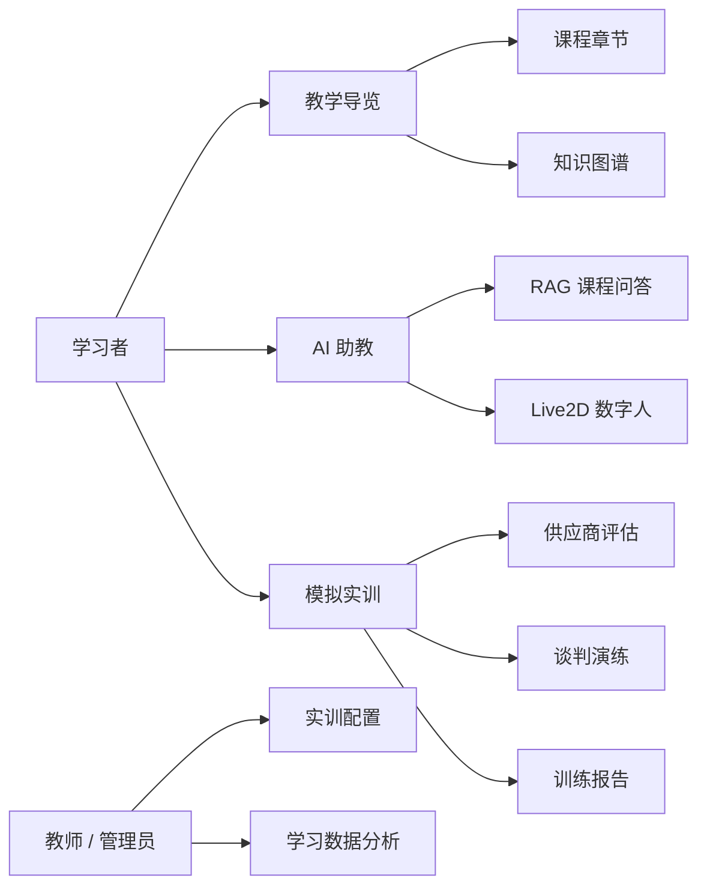
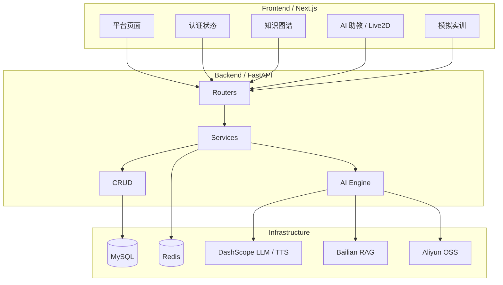

<div align="center">
  

  <h1>供应链寻源课程平台</h1>

  <p>
    <strong>Supply Chain Sourcing Learning Platform</strong>
  </p>

  <p>
    面向采购寻源课程的 AI 教学、知识图谱与模拟实训平台
  </p>

  <p>
    <a href="#-项目亮点">项目亮点</a> ·
    <a href="#-技术栈">技术栈</a> ·
    <a href="#-快速启动">快速启动</a> ·
    <a href="#-系统架构">系统架构</a> ·
    <a href="#-api-总览">API</a>
  </p>

  <p>
    
    
    
    
    
    
  </p>
</div>

---

## ✨ 项目亮点

供应链寻源课程平台是一个围绕“采购寻源基础”课程构建的全栈教学平台。它把传统课程内容、AI 助教、Live2D 数字人、知识图谱和场景化实训整合到同一个学习工作台里，让学生不仅能看课程，还能问问题、看关联、做决策、拿反馈。

| 模块 | 能力 | 当前状态 |
| --- | --- | --- |
| 教学导览 | 课程入口、章节导航、知识图谱、学习行为埋点 | 已接入章节与知识图谱接口 |
| AI 助教 | 多轮会话、SSE 流式回复、历史会话、课程问答 | 已接入真实后端接口 |
| Live2D 数字人 | 悬浮入口、角色动作、语音问答、TTS 音频播放 | 已完成核心交互 |
| 课程文档 | 章节正文、PDF/HTML 教学资源、局部问答、笔记进度 | 接口与资源已准备 |
| 模拟实训 | 案例列表、分步骤训练、供应商评估、谈判模拟、报告 | 后端服务与种子数据已建立 |
| 用户体系 | 注册登录、JWT、游客访问、受限操作登录拦截 | 已完成基础闭环 |

---

## 🧭 产品视图



---

## 🛠 技术栈

### Frontend

- **Next.js 16 / React 19 / TypeScript**
- App Router 路由分组：`(auth)`、`(platform)`
- Feature-first 目录组织：认证、导览、课程、助教、实训各自封装
- 原生 SVG 知识图谱交互：拖拽、缩放、节点详情、高亮关系
- Live2D / Cubism / Pixi 资源加载与动作状态切换

### Backend

- **FastAPI + Pydantic + SQLAlchemy Async**
- MySQL 持久化、Redis 限流/缓存/去重
- JWT 登录认证与统一响应结构
- 阿里云 DashScope：LLM、TTS
- 阿里云百炼：RAG 知识库检索
- 阿里云 OSS：音频与教学资源存储

---

## 📦 项目结构

```text
supplychain-claude
├─ backend
│  ├─ main.py                       # FastAPI 入口
│  ├─ requirements.txt              # Python 依赖
│  ├─ app
│  │  ├─ core                       # 配置、数据库、鉴权、响应、中间件
│  │  ├─ routers                    # HTTP API 路由
│  │  ├─ services                   # 业务编排
│  │  ├─ crud                       # 数据访问
│  │  ├─ engine                     # LLM / RAG / TTS / OSS 引擎封装
│  │  ├─ models                     # SQLAlchemy 模型
│  │  └─ schemas                    # Pydantic 入参与出参
│  ├─ sql                           # 初始化与增量 SQL
│  └─ static                        # 课程、实训、图片等静态资源
│
├─ frontend
│  └─ web
│     ├─ app                        # Next.js App Router 页面
│     ├─ features                   # 业务模块
│     ├─ lib                        # API、常量、共享工具
│     └─ public                     # 图标、背景、Live2D 角色资源
│
├─ docs                             # 项目说明、课程资料、部署文档
├─ LICENSE
└─ README.md
```

---

## 🚀 快速启动

### 1. 克隆项目

```bash
git clone https://github.com/<your-name>/supplychain-claude.git
cd supplychain-claude
```

### 2. 启动后端

```bash
cd backend
python -m venv .venv
.venv\Scripts\activate
pip install -r requirements.txt
python main.py
```

后端默认运行在：

```text
http://127.0.0.1:8000
```

Swagger 文档：

```text
http://127.0.0.1:8000/docs
```

### 3. 启动前端

```bash
cd frontend/web
npm install
npm run dev
```

前端默认运行在：

```text
http://127.0.0.1:3030
```

### 4. 前端环境变量

在 `frontend/web` 下创建 `.env.local`：

```env
NEXT_PUBLIC_API_BASE_URL=http://127.0.0.1:8000/api/v1
```

### 5. 后端环境变量

在 `backend` 下创建 `.env`，按需填写：

```env
APP_NAME=供应链寻源课程平台
APP_VERSION=1.0.0
DEBUG=true

DB_HOST=localhost
DB_PORT=3306
DB_NAME=supplychain
DB_USER=root
DB_PASSWORD=

REDIS_HOST=localhost
REDIS_PORT=6379
REDIS_DB=0
REDIS_PASSWORD=

JWT_SECRET_KEY=change-me-in-production

DASHSCOPE_API_KEY=
LLM_MODEL=qwen-plus
TTS_MODEL=qwen3-tts-flash-realtime
TTS_VOICE=longxiaochun

BAILIAN_WORKSPACE_ID=
BAILIAN_INDEX_ID=

OSS_ACCESS_KEY_ID=
OSS_ACCESS_KEY_SECRET=
OSS_BUCKET_NAME=
OSS_ENDPOINT=oss-cn-beijing.aliyuncs.com
OSS_CDN_DOMAIN=
```

---

## 🧱 系统架构



后端保持清晰的调用链：

```text
router -> service -> crud / engine -> model / schema
```

前端保持业务聚合：

```text
app route -> feature module -> api / components / hooks / types
```

---

## 🔌 API 总览

所有业务接口统一挂载在：

```text
/api/v1
```

| 模块 | 方法与路径 | 说明 |
| --- | --- | --- |
| Auth | `POST /auth/register` | 用户注册 |
| Auth | `POST /auth/login` | 用户登录 |
| Auth | `GET /auth/me` | 当前用户信息 |
| Chat | `POST /chat/conversations` | 创建会话 |
| Chat | `GET /chat/conversations` | 会话列表 |
| Chat | `POST /chat/messages` | 普通 / 语音模式回复 |
| Chat | `POST /chat/messages/stream` | SSE 流式回复 |
| Course | `GET /course/chapters` | 章节树 |
| Course | `GET /course/chapters/{chapter_id}` | 章节详情 |
| Course | `POST /course/chapters/{chapter_id}/ask` | 章节局部问答 |
| Course | `GET /course/knowledge-graph` | 知识图谱 |
| Training | `GET /training/cases` | 实训案例列表 |
| Training | `GET /training/cases/{case_id}` | 实训案例详情 |
| Training | `POST /training/cases/{case_id}/steps/{step}/submit` | 提交步骤答案 |
| Analytics | `POST /analytics/track` | 行为埋点 |
| System | `GET /system/health` | 健康检查 |

---

## 🧪 常用脚本

### Frontend

```bash
npm run dev
npm run build
npm run start
npm run typecheck
```

### Backend

```bash
python main.py
```

---

## 🗺 Roadmap

- [x] Next.js + FastAPI 基础工程骨架
- [x] 用户注册、登录、JWT 与游客访问
- [x] AI 助教会话、历史记录与流式输出
- [x] Live2D 数字人挂载与语音问答
- [x] 教学导览知识图谱接口与前端交互
- [x] 实训案例、步骤、报告等后端结构
- [ ] 课程正文阅读器、划词问答与学习笔记
- [ ] 实训前端完整流程与评分反馈
- [ ] 教师端数据看板与内容配置
- [ ] 更完善的部署脚本、测试体系与 CI

---

## 🖼 资源与内容

项目内置了采购寻源课程资料、章节 PDF、HTML 教学内容、知识图谱初始化脚本、实训供应商素材以及 Live2D 角色资源。核心素材位于：

```text
docs/course_md
backend/static/course
backend/static/course-html
backend/static/training
frontend/web/public/characters
```

---

## 🤝 贡献

欢迎提交 Issue 或 Pull Request。建议改动时遵循当前分层：

- 前端页面能力优先放入对应 `features/*`
- 后端业务逻辑优先放入 `services/*`
- 数据读写保持在 `crud/*`
- 外部 AI、TTS、RAG、OSS 能力保持在 `engine/*`

---

## 📄 License

本项目基于 [MIT License](./LICENSE) 开源。

<div align="center">
  <sub>Built for smarter sourcing education, one decision scenario at a time.</sub>
</div>
